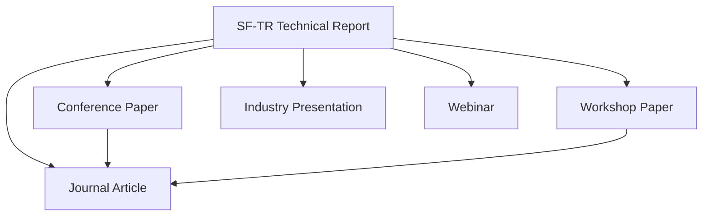

# Journal and Conference Roadmap

How Synaptic Four Technical Reports may evolve into formal academic and industry publications.

## Guiding Principle

**SF-TR reports remain the canonical open archive.** Conference papers, journal articles, and presentations are derived works. The technical report is published first (or concurrently); adapted versions cite the SF-TR DOI.

This approach:

- Preserves full technical depth (journals often limit page count)
- Provides an immediate citable artefact
- Allows iterative refinement before formal peer review
- Maintains a single source of truth on GitHub and Zenodo

## Evolution Pathways

| Output | Typical timeline after SF-TR | Effort |
|--------|------------------------------|--------|
| Conference paper | 3–9 months | Moderate — restructure for page limits, add evaluation |
| Workshop paper | 1–6 months | Low–moderate — shorter format, niche audience |
| Journal article | 6–18 months | High — expand evaluation, address peer review |
| Industry presentation | 1–3 months | Low — extract key diagrams and findings |
| Webinar | 1–3 months | Low — present SF-TR content with live demo |

## Report Types and Formal Publication Suitability

| SF-TR Category | Conference | Workshop | Journal | Notes |
|----------------|------------|----------|---------|-------|
| Architecture Report | ✓ Strong | ✓ | ✓ With evaluation | Add benchmarks or case study for journal |
| Reference Implementation | ✓ Strong | ✓ Strong | ✓ | Demonstrate interoperability results |
| Standards Implementation Report | ✓ Strong | ✓ Strong | ○ Moderate | Best at standards-focused venues |
| Design Document | ○ Weak | ✓ | ○ Weak | Usually remains SF-TR only |
| Benchmark Study | ✓ Strong | ✓ | ✓ Strong | Ideal for formal publication |
| Deployment Case Study | ✓ | ✓ Strong | ✓ | Emphasise lessons learned and metrics |
| Security Analysis | ✓ | ✓ | ✓ | Redact sensitive details in SF-TR before publication |
| Interoperability Guide | ✓ | ✓ Strong | ○ Moderate | Workshop and demo-track friendly |
| Research Infrastructure Report | ✓ | ✓ | ✓ | Position as systems or infrastructure paper |
| Position Paper | ○ Moderate | ✓ | ○ Moderate | Better as invited or workshop contribution |

Legend: ✓ Strong = good fit; ✓ = viable with adaptation; ○ = possible but not default.

## Suggested Venues

### GA4GH and standards community

| Venue | Format | Suitable reports |
|-------|--------|------------------|
| GA4GH Plenary | Presentation, poster | Standards Implementation, Reference Implementation |
| GA4GH Work Streams | Technical contribution | All implementation-focused reports |
| ELIXIR / GHIF events | Presentation | Interoperability, FAIR reports |

### FAIR and research data management

| Venue | Format | Suitable reports |
|-------|--------|------------------|
| RDA Plenary | Working group, poster | FAIR-by-Design, Research Infrastructure |
| Open Repositories (OR) | Paper, poster | FAIR, deployment case studies |
| Force11 | Workshop, presentation | FAIR, metadata, governance |

### Bioinformatics

| Venue | Format | Suitable reports |
|-------|--------|------------------|
| ISMB / ECCB | Poster, proceedings | Architecture, benchmarks, multi-omics |
| Bioinformatics Open Source Conference (BOSC) | Talk, proceedings | Reference implementations |
| GCC (Galaxy Community Conference) | Workshop, demo | Platform and pipeline reports |

### Research software engineering

| Venue | Format | Suitable reports |
|-------|--------|------------------|
| RSE Conference (UK/DE/EU) | Talk, poster | Architecture, deployment, lessons learned |
| deRSE | Talk | German-language outreach |
| IEEE/ACM SECSE (at ICSE) | Paper | Architecture, benchmarks |

### Data infrastructure

| Venue | Format | Suitable reports |
|-------|--------|------------------|
| Strata / data infra meetups | Industry talk | Federated patterns, security |
| KubeCon / cloud-native events | Talk | Deployment, Kubernetes patterns |
| Health informatics conferences | Paper, workshop | Secure access, translational |

## Adaptation Checklist

When converting an SF-TR to a conference or journal submission:

- [ ] Identify the **core contribution** (may be narrower than the full report)
- [ ] Add **formal evaluation** if missing (benchmarks, user study, deployment metrics)
- [ ] Restructure for venue page limits
- [ ] Cite the SF-TR DOI as the extended technical version
- [ ] Check venue policy on **prior publication** (SF-TR is usually acceptable as non-peer-reviewed preprint)
- [ ] Remove Synaptic Four-internal details inappropriate for peer review
- [ ] Coordinate authorship and affiliation with all contributors
- [ ] Update SF-TR changelog noting the derived publication

## Conditions for Journal Adaptation

Journal submission is warranted when:

1. The report includes **novel methodology** or **significant empirical evaluation**
2. The contribution generalises **beyond Synaptic Four's specific products**
3. A **target journal scope** clearly matches the content
4. Resources exist for **peer review revision cycles**

Journal submission is **not** warranted when:

- The report is primarily internal operations documentation
- Content is a straightforward standards implementation without new insight
- The report is superseded by rapid product changes

## Industry Presentations and Webinars

Low-effort, high-impact channels:

- Extract 3–5 key diagrams from architecture reports
- Present at GA4GH Plenary or partner consortium meetings
- Host webinars linked from synapticfour.com with recording archived
- Reference SF-TR DOI in slides and description

## Related Documents

- [future-reports.md](future-reports.md)
- [publication-categories.md](publication-categories.md)
- [publication-strategy.md](publication-strategy.md)
