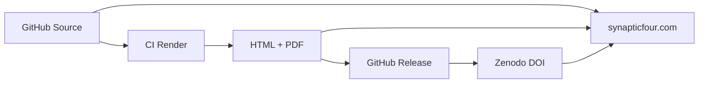

# Website Publishing Strategy

How Synaptic Four Technical Reports integrate with [synapticfour.com](https://synapticfour.com).

## Canonical Publication Workflow



| Step | System | Role |
|------|--------|------|
| 1 | GitHub (`technical-reports` repo) | **Canonical source** — Quarto/Markdown, version controlled |
| 2 | GitHub Actions | **Build** — Generate HTML and PDF |
| 3 | GitHub Releases | **Distribution** — Versioned artefacts attached to tags |
| 4 | Zenodo | **Archival** — Persistent DOI for citation |
| 5 | synapticfour.com | **Discovery** — Human-facing publication hub and landing pages |

## Source of Truth Hierarchy

1. **Git repository at release tag** — Authoritative source
2. **Zenodo deposit** — Authoritative archival snapshot with DOI
3. **synapticfour.com** — Discovery and summary; links to 1 and 2
4. **Rendered PDF** — Convenience format; derived from 1

Never treat the website copy as authoritative if it diverges from the tagged source. Fix divergence by updating the website to match the release.

## synapticfour.com Integration

The website publications hub (`synapticfour-website/src/pages/[locale]/publications.astro`) lists entries with:

- Title, summary, category badge
- Link to dedicated publication page
- PDF download links (EN/DE where applicable)
- GitHub source link
- DOI link (when available)

### Adding a New Report

1. **Host rendered outputs** — Copy PDF to `synapticfour-website/public/papers/` or link to GitHub Release assets.
2. **Add hub entry** — Extend the `entries` array in `publications.astro`.
3. **Add i18n strings** — Title, summary, badge in `src/i18n/en.ts` (and `de.ts`, French overlays as needed).
4. **Create publication page** — Dedicated Astro page or generic template driven by `catalog.yaml`.
5. **Cross-link** — Link from relevant product pages (Ferrum, Mycelium, etc.).

### Recommended URL Pattern

```
https://synapticfour.com/publications/sf-tr-2026-001
https://synapticfour.com/en/publications/sf-tr-2026-001
```

Use lowercase slugs derived from the SF-TR identifier.

## Advantages and Disadvantages

### GitHub as canonical source

| Advantages | Disadvantages |
|------------|---------------|
| Full version history | Less approachable for non-technical readers |
| Pull request review workflow | Requires Git literacy to contribute |
| Linked to CI rendering | Not a traditional "publisher" in academic sense |
| Free for open repositories | Dependent on GitHub availability |

### Generated HTML and PDF

| Advantages | Disadvantages |
|------------|---------------|
| Consistent formatting via Quarto | PDF build requires LaTeX in CI |
| Multiple output formats from one source | Complex diagrams may need tuning per format |
| Reproducible builds | Build time increases with report count |

### synapticfour.com publication pages

| Advantages | Disadvantages |
|------------|---------------|
| Brand-consistent presentation | Additional maintenance per report |
| Localised summaries (EN/DE/FR) | Risk of drift from canonical source |
| Integration with product narrative | Not independently archived (no DOI) |
| SEO and discoverability | Requires website deploy for updates |

### Zenodo DOI archive

| Advantages | Disadvantages |
|------------|---------------|
| Citable persistent identifier | Metadata curation effort per release |
| Independent of GitHub | Snapshot may lag if release process is delayed |
| Recognised by funders and publishers | Version proliferation with frequent patches |
| Long-term preservation mandate | Less interactive than HTML |

## Recommended Practices

- Every public report has all four layers: GitHub source, rendered outputs, website page, Zenodo DOI.
- Website summaries should be **excerpts** of the abstract, not independent prose.
- Display the SF-TR identifier, version, and DOI prominently on every publication page.
- Link "View source on GitHub" and "Cite this report" on every page.
- Migrate existing whitepapers (e.g. Ferrum) into SF-TR format when revised.

## Future Enhancements

- Auto-generate website entries from `publications-index/catalog.yaml`
- Host HTML reports on `synapticfour.com` via iframe or static import from release assets
- Add structured data (JSON-LD) with DOI for search engines
- Syndicate new report announcements via RSS/Atom feed

## Related Documents

- [workflow.md](workflow.md)
- [zenodo-integration.md](zenodo-integration.md)
- [citation-guide.md](citation-guide.md)
