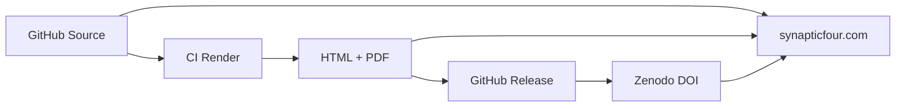

# Website Publishing Strategy

How Synaptic Four Technical Reports integrate with [synapticfour.com](https://synapticfour.com).

## Canonical Publication Workflow



| Step | System | Role |
|------|--------|------|
| 1 | GitHub (`technical-reports` repo) | **Canonical source** — Quarto/Markdown, version controlled |
| 2 | GitHub Actions | **Build** — Generate HTML and PDF |
| 3 | GitHub Releases | **Distribution** — Versioned artefacts attached to tags |
| 4 | Zenodo | **Archival** — Persistent DOI for citation |
| 5 | synapticfour.com | **Discovery** — Publication hub and report landing pages |

## Source of Truth Hierarchy

1. **Git repository at release tag** — Authoritative source
2. **Zenodo deposit** — Authoritative archival snapshot with DOI
3. **synapticfour.com** — Discovery and summary; links to 1 and 2
4. **Rendered PDF** — Convenience format; derived from 1

Never treat the website copy as authoritative if it diverges from the tagged source. Fix divergence by updating the website to match the release.

## synapticfour.com Integration

The publications hub lives in the `synapticfour-website` repository:

- Catalogue: `src/data/publicationsCatalog.ts` (mirror of `publications-index/catalog.yaml`)
- Pages: `src/pages/[locale]/publications/`
- Copy: `src/i18n/pubSeries-{de,en,fr}.ts`

Each published report should have:

- Entry in `publicationsCatalog.ts` and `catalog.yaml`
- A landing page (or shared template) under `/publications/sf-tr-YYYY-NNN`
- Links to GitHub release HTML/PDF, source tree, and Zenodo DOI

### Adding a New Report

1. Publish the GitHub Release with rendered HTML and PDF assets.
2. Mint the Zenodo version DOI and update `catalog.yaml` and report front matter.
3. Add the report to `publicationsCatalog.ts` in `synapticfour-website`.
4. Add or generate the locale publication page and i18n strings.
5. Cross-link from relevant product pages where appropriate.

### Recommended URL Pattern

```
https://synapticfour.com/de/publications/sf-tr-2026-001/
https://synapticfour.com/en/publications/sf-tr-2026-001/
```

Use lowercase slugs derived from the SF-TR identifier.

## Recommended Practices

- Every public report has all four layers: GitHub source, rendered outputs, website page, Zenodo DOI.
- Website summaries should be **excerpts** of the abstract, not independent prose.
- Display the SF-TR identifier, version, and DOI prominently on every publication page.
- Link "View source on GitHub" and citation guidance on every page.

## Related Documents

- [workflow.md](workflow.md)
- [zenodo-integration.md](zenodo-integration.md)
- [citation-guide.md](citation-guide.md)
