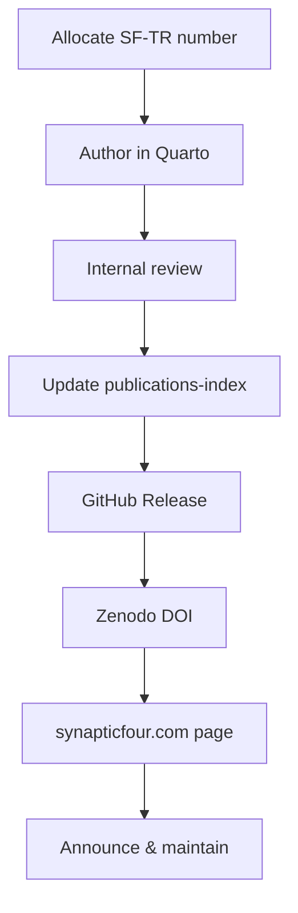

# Publication Workflow

End-to-end process for authoring, releasing, archiving, and maintaining Synaptic Four Technical Reports.

## Overview



## 1. Writing a Report

### Allocate an identifier

1. Check `publications-index/catalog.yaml` for the next available `SF-TR-YYYY-NNN`.
2. Add a draft entry with `status: draft`.
3. Copy the template:

   ```bash
   cp -r templates/SF-TR-YYYY-NNN-template reports/SF-TR-2026-001
   ```

### Author content

- Edit `paper.qmd` front matter: title, authors, abstract, keywords, category.
- Write sections following the template structure.
- Add references to `references.bib`.
- Place figures in `reports/SF-TR-YYYY-NNN/figures/`.
- Render locally before opening a pull request:

  ```bash
  cd reports/SF-TR-2026-001
  quarto render paper.qmd
  ```

### Review

- Technical accuracy review by domain lead.
- Editorial review for clarity and consistency.
- Security review for reports describing production systems.
- Update `status` to `in_review` during review.

## 2. Creating a Release

1. Merge the report to `main`.
2. Confirm CI renders HTML and PDF successfully.
3. Create a GitHub Release:
   - **Tag:** `SF-TR-YYYY-NNN-vX.Y.Z` (e.g. `SF-TR-2026-001-v1.0.0`)
   - **Title:** `SF-TR-2026-001 v1.0.0: Report Title`
   - **Description:** Abstract, changelog, links to source paths
   - **Assets:** CI attaches rendered HTML and PDF automatically
4. Update `publications-index/catalog.yaml`:
   - Set `status: published`
   - Set `version`, `date`, `github_release`

## 3. Minting a DOI through Zenodo

See [zenodo-integration.md](zenodo-integration.md) for setup details.

After GitHub–Zenodo integration is configured:

1. Zenodo creates a draft record when a GitHub Release is published.
2. Review metadata on Zenodo (authors, description, license, keywords).
3. Publish the Zenodo record to mint a DOI.
4. Add `doi` and `zenodo` fields to `catalog.yaml` and report front matter.
5. Re-render if DOI should appear in the PDF title page (optional patch release).

## 4. Publishing on synapticfour.com

See [website-publishing.md](website-publishing.md).

1. Add an entry to the publications hub (`publications.astro` entries array).
2. Create a dedicated publication page or link to hosted HTML/PDF.
3. Add i18n strings for title, summary, and badges.
4. Link to GitHub source, DOI, and PDF downloads.
5. Update `website` field in `catalog.yaml`.

## 5. Versioning Reports

| Scenario | Action |
|----------|--------|
| Typo or minor correction | Patch release (`v1.0.1`); new Zenodo version |
| New sections or benchmarks | Minor release (`v1.1.0`); new Zenodo version |
| Major architectural revision | Major release (`v2.0.0`); update abstract and changelog |
| Report superseded by new topic | Keep old report; publish new report with new SF-TR number |

Always:

- Retain prior GitHub Release tags and Zenodo versions.
- Document changes in the report's Appendix C (Change Log).
- Set `status: revised` on superseded major versions if the old version should not be promoted as current.

## 6. Updating Reports

1. Create a feature branch; edit source under `reports/SF-TR-YYYY-NNN/`.
2. Increment version per semantic versioning rules.
3. Merge via pull request with review.
4. Create new GitHub Release with incremented tag.
5. Publish new Zenodo version (linked to same conceptual record).
6. Update website page and `catalog.yaml`.

## Best Practices

- **Write for permanence.** Reports should remain comprehensible without access to internal systems.
- **Cite upstream standards.** Reference GA4GH, FAIR, and relevant RFCs with version numbers.
- **Include diagrams.** Architecture reports should have at least one architecture diagram.
- **Document limitations honestly.** Credibility depends on stated boundaries.
- **Keep source and outputs linked.** Every public PDF should trace to a tagged Git commit.
- **Do not delete releases.** Withdraw if necessary; never rewrite published history.
- **Register early.** Add draft entries to the index when numbering is allocated to prevent collisions.

## Related Documents

- [zenodo-integration.md](zenodo-integration.md)
- [website-publishing.md](website-publishing.md)
- [citation-guide.md](citation-guide.md)
- [contributing.md](contributing.md)
