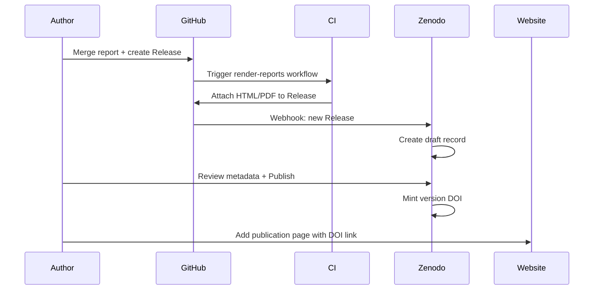

# Zenodo Integration

Guide to archiving Synaptic Four Technical Reports on [Zenodo](https://zenodo.org) with citable DOIs.

## Why Zenodo

| Benefit | Description |
|---------|-------------|
| Persistent DOI | Standard identifier for citations and funding reports |
| Version archival | Each release version receives its own DOI |
| Long-term storage | CERN-operated infrastructure with migration commitments |
| GitHub integration | Automatic ingestion from GitHub Releases |
| Open access | Supports CC BY and other open licenses |

## Prerequisites

- GitHub repository: `SynapticFour/technical-reports`
- Zenodo account linked to GitHub
- At least one GitHub Release with rendered assets

## One-Time Setup

### 1. Connect GitHub to Zenodo

1. Sign in to [Zenodo](https://zenodo.org) (or [sandbox.zenodo.org](https://sandbox.zenodo.org) for testing).
2. Navigate to **Account → GitHub** and enable access for the `SynapticFour` organisation.
3. Toggle **ON** for the `technical-reports` repository.

### 2. Configure default metadata

In Zenodo repository settings for `technical-reports`, set defaults:

| Field | Recommended value |
|-------|-------------------|
| Upload type | Publication → Technical Report |
| Publication date | Release date |
| Authors | Synaptic Four + report authors |
| License | Creative Commons Attribution 4.0 (CC BY 4.0) |
| Keywords | From report front matter |
| Related identifiers | Link to synapticfour.com page, GitHub repo |

### 3. Test with sandbox (recommended)

1. Enable the repository on [sandbox.zenodo.org](https://sandbox.zenodo.org) first.
2. Create a test release tag.
3. Verify draft record creation and rendering assets.
4. Switch to production Zenodo when satisfied.

## Per-Release Workflow



### Steps

1. **Create GitHub Release** with tag `SF-TR-YYYY-NNN-vX.Y.Z`.
2. **Wait for CI** to attach `SF-TR-YYYY-NNN.html` and `.pdf` to the release.
3. **Open Zenodo** — a draft deposit appears under your uploads (may take a few minutes).
4. **Review metadata:**
   - Title matches report title
   - Description contains abstract
   - Authors and ORCIDs are correct
   - License matches report front matter
   - `SF-TR-YYYY-NNN` appears in keywords or description
5. **Publish** the deposit to mint the DOI.
6. **Record the DOI** in:
   - `publications-index/catalog.yaml`
   - Report `paper.qmd` front matter (`doi:` field)
   - synapticfour.com publication page

## DOI Structure

Zenodo provides:

- **Concept DOI** — Identifies all versions of a deposit (e.g. `10.5281/zenodo.1234567`)
- **Version DOI** — Identifies a specific release (e.g. `10.5281/zenodo.1234568`)

**Recommendation:** Cite the **version DOI** for precision. Reference the concept DOI when referring to the report series in general.

## CITATION.cff and Zenodo

Individual reports may include a `CITATION.cff` in their report directory. Zenodo ingests CITATION.cff from the repository root for software; for per-report citation, ensure metadata is set correctly in the Zenodo deposit UI.

Example per-report `CITATION.cff` (place in `reports/SF-TR-2026-001/`):

```yaml
cff-version: 1.2.0
title: "Ferrum Architecture: A GA4GH-Native Genomics Platform"
authors:
  - name: Synaptic Four
message: "If you use this work, please cite using the DOI."
type: report
doi: 10.5281/zenodo.XXXXXXX
```

## Troubleshooting

| Issue | Resolution |
|-------|------------|
| No Zenodo draft after release | Confirm repo is enabled in Zenodo GitHub settings; check release is on `main` default branch |
| Missing PDF in deposit | Verify CI completed; PDF requires TinyTeX in workflow |
| Wrong files archived | Zenodo archives the repository snapshot at release tag; ensure tag points to correct commit |
| Metadata incorrect | Edit in Zenodo UI before publishing; reserve-doi if needed for pre-publication |

## Best Practices

- Publish Zenodo records within 48 hours of GitHub Release.
- Never delete published Zenodo records; create new versions instead.
- Include the SF-TR identifier in the Zenodo title suffix: `(SF-TR-2026-001)`.
- Add the DOI to the report PDF (front matter `doi:` field) before major releases.
- Use sandbox Zenodo for workflow dry-runs.

## Related Documents

- [workflow.md](workflow.md)
- [citation-guide.md](citation-guide.md)
- [website-publishing.md](website-publishing.md)
