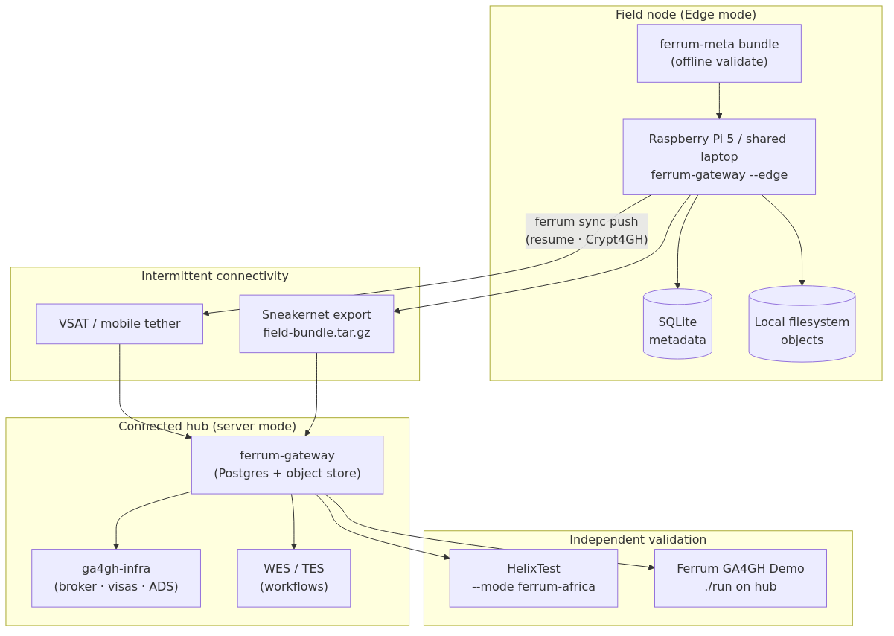
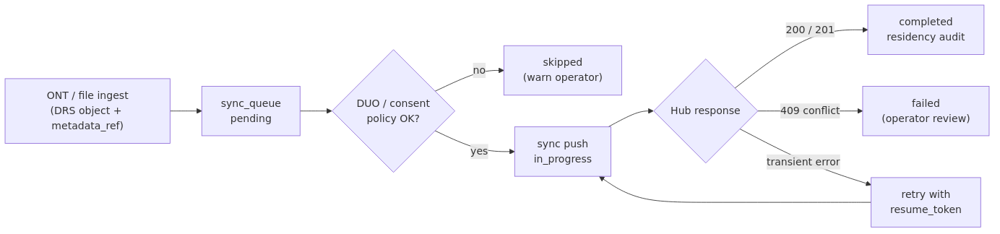

# Executive Summary {.unnumbered}

Synaptic Four Technical Report SF-TR-2026-001 documents Ferrum as an integrated,
on-premises-first GA4GH runtime for datacentre and laboratory deployments
[@sf_tr_2026_001]. Many genomics use cases — field pathogen surveillance,
Nanopore sequencing at point of collection, and national programmes with data
sovereignty requirements — need the **same standards** on hardware that cannot
assume PostgreSQL, Docker registries, or continuous connectivity.

**Ferrum Field & Edge** addresses this with a second runtime profile:

1. **Embedded stack** — SQLite metadata and local filesystem objects via the
   `ferrum-embed` crate; single-process `ferrum-gateway` on Raspberry Pi 5 or
   shared laptops.
2. **Offline metadata** — ferrum-meta bundles validated before ingest; linked to
   DRS objects via `metadata_ref` [@ferrum_meta2026].
3. **Deferred sync** — a `sync_queue` uploads selected objects (and metadata)
   to a connected hub when VSAT, mobile tether, or sneakernet transport is
   available.
4. **Resilience controls** — bandwidth-adaptive DRS streaming, optional
   solar/battery power modes, and an append-only residency audit chain.
5. **Pathogen workflows** — ONT multipart ingest, multi-pathogen Beacon
   filters, and opt-in Outbreak Mode for policy-gated emergency sharing.

This report is a **companion** to SF-TR-2026-001. Read SF-TR-2026-001 for full
server-stack architecture, Crypt4GH DRS integration detail, and multi-engine WES/TES
execution. Read this report for edge topology, sync semantics, and field validation.

---

# Introduction

The Global Alliance for Genomics and Health (GA4GH) specifies interoperable APIs
for genomic data access and compute [@ga4gh2024framework]. Implementations that
exercise DRS, Beacon, htsget, WES, and Passports together are still uncommon in
production; implementations that do so **offline on ARM edge hardware** are rarer
still.

Ferrum Field & Edge extends the Ferrum platform [@ferrum2026] with an embedded
runtime (`ferrum demo start --edge`) and a documented **split topology**: edge
nodes capture and encrypt data locally; connected hubs run the full PostgreSQL
stack, workflow engines, and reproducible benchmarks via the Ferrum GA4GH Demo
[@ferrum_demo2026].

**Audience:** Field bioinformaticians, national programme architects, ELIXIR and
GHIF infrastructure teams, and GA4GH implementers evaluating edge-to-hub patterns.

**Scope:** Edge architecture, metadata integration, sync and auth under long
offline periods, pathogen/outbreak workflows, validation methodology, and
deployment guidance. Customer-specific operational runbooks and formal regulatory
certification are out of scope.

**Relationship to SF-TR-2026-001:** SF-TR-2026-001 remains the canonical reference
for server-centre Ferrum. This report does not repeat Crypt4GH header re-wrapping
mechanics or WES→TES engine routing in full; it references SF-TR-2026-001 where
those behaviours are identical on hub deployments.

# Background

## Resource-Constrained Genomics

Field and national-laboratory genomics often face constraints that datacentre
architectures assume away:

| Constraint | Typical impact |
|:---|:---|
| Intermittent connectivity | Cannot rely on cloud object stores or OIDC live JWKS fetch |
| Limited RAM (4–16 GB) | PostgreSQL + MinIO + workflow engines exceed budget on Pi-class hardware |
| ARM edge hardware | x86-only container images and demo stacks do not deploy natively |
| Data sovereignty | Operators must demonstrate where bytes leave the node |
| Pathogen urgency | Yes/no Beacon access may be needed before full DRS download approval |
| Shared devices | Multiple collectors on one laptop require local role separation |

FAIR principles [@wilkinson2016fair] still apply: metadata must be captured at
collection time, not reconstructed after sync.

## Terminology

| Term | Meaning in this report |
|:---|:---|
| **Edge mode** | Ferrum runtime with SQLite + local storage (`FERRUM_OFFLINE=1` or `--edge`) |
| **Hub** | Connected Ferrum server (PostgreSQL, optional ga4gh-infra co-deploy) |
| **Field node** | Edge device at point of collection (Pi, laptop) |
| **ferrum-meta** | LinkML metadata schema validated offline before ingest |
| **Sneakernet** | Physical export via `ferrum sync export` to removable media |

# Problem Statement

Research and public-health genomics teams need:

1. **Standards-aligned capture offline** — DRS object registration, Crypt4GH at
   rest [@crypt4gh2020], and Beacon/htsget where indexed, without Docker or
   PostgreSQL.
2. **Metadata before upload** — Archive-ready bundles (H3Africa, pathogen, GHGA
   profiles) validated without network access.
3. **Controlled sync** — Selective upload to hubs with resume, consent/DUO
   filtering, and auditable data movement.
4. **Authentication across offline gaps** — JWKS caching, local edge accounts,
   and field roles when ga4gh-infra is unreachable.
5. **Pathogen-specific workflows** — ONT ingest, multi-organism Beacon queries,
   and policy-gated outbreak sharing without abandoning GA4GH APIs.
6. **Independent validation** — Conformance tests operators can run against edge
   and hub profiles separately [@helixtest2026].

The gap is not another lightweight file sync tool. The gap is a **GA4GH-native
edge runtime** that composes with the same hub stack documented in
SF-TR-2026-001, with honest scoping of what Edge mode excludes (WES/TES on
device).

# Related Work

| Approach | Contribution | Gap relative to Ferrum Field |
|:---|:---|:---|
| SF-TR-2026-001 Ferrum server stack [@sf_tr_2026_001] | Full GA4GH composition | Requires Postgres, not field-portable |
| GA4GH Starter Kit | Per-API reference implementations | No offline embedded profile |
| Cloud genomics platforms | Managed scale | Cloud dependency, sovereignty concerns |
| Generic sync (rsync, rclone) | Byte transport | No DRS semantics, metadata, or audit chain |
| ferrum-meta [@ferrum_meta2026] | Metadata schema layer | Schema only; Ferrum implements runtime binding |

Ferrum Field deliberately **does not** integrate delay-tolerant mesh transport
(e.g. Mycelium) in this release. Federated Beacon queries use configurable HTTP
peers (see @sec-federation); mesh messaging remains future work cross-referenced
from SF-TR-2026-001.

# System Architecture

## Split Topology

@fig-edge-topology shows the recommended deployment pattern: field nodes operate
autonomously; hubs provide identity, workflows, and reproducible benchmarks.

{#fig-edge-topology width=95% fig-pos="H"}

Design principle: **never run the full Ferrum GA4GH Demo stack on a Raspberry Pi**.
Benchmarks and WES/TES execute on the hub; the Pi ingests, indexes locally, and
syncs upstream.

## Edge Runtime (`ferrum-embed`)

The `ferrum-embed` crate provides:

- `EmbedMode` configuration (`offline_first`, memory caps, SQLite paths)
- `SqliteStorage` and `PostgresStorage` behind a shared `Database` trait
- Local object storage under `~/.ferrum/objects/` (configurable)

Starting Edge mode:

```bash
ferrum demo start --edge
# Equivalent: FERRUM_OFFLINE=1 ferrum start
```

Expected data layout:

```
~/.ferrum/
  ferrum.db          # SQLite metadata (DRS, Beacon, sync_queue, audit)
  objects/           # Content-addressed or DRS-managed blobs
  jwks/              # Optional offline JWKS files (Phase 3 auth)
```

## GA4GH Surface on Edge vs Hub

@tbl-edge-surface compares API availability. Edge mode is intentionally subset.

| Service | Edge mode | Hub (server mode) |
|:---|:---:|:---:|
| DRS ingest, metadata, `/stream` | ✓ | ✓ |
| Crypt4GH at rest + re-wrap | ✓ | ✓ |
| Beacon v2 (incl. pathogen filters) | ✓ | ✓ |
| htsget (when objects indexed) | ✓ | ✓ |
| WES / TES / TRS | ✗ (`503`) | ✓ |
| Full Passports / OIDC live flows | ✗ or degraded | ✓ |
| Sync queue API | ✓ | ✓ (receive) |
| Residency audit | ✓ | ✓ |

: GA4GH and Ferrum API availability by deployment profile. {#tbl-edge-surface tbl-colwidths="[52,24,24]"}

For full conformance matrices, use the Docker demo stack or production Postgres
deployment documented in SF-TR-2026-001 and Ferrum's HelixTest integration guide.

## Metadata Integration {#sec-metadata}

ferrum-meta [@ferrum_meta2026] is the **metadata plane** — LinkML schemas,
archive profiles (GHGA, EGA, H3Africa, pathogen, EVA), and offline validation.
Ferrum implements the **runtime binding**:

1. Operator prepares a ferrum-meta submission (YAML/JSON) offline.
2. At ingest, optional field `ferrum_meta` is validated via `ferrum-meta-connect`.
3. Ferrum stores the submission in `metadata_submissions` and sets
   `metadata_ref` on created DRS objects.
4. On sync, metadata travels with objects; hubs can transpile to upstream archives.

CLI helpers:

```bash
ferrum meta init --profile pathogen
ferrum meta import --file submission.yaml
ferrum ingest watch --meta-bundle ./bundle/
```

Provenance fields on ONT ingest (`collector`, `collected_at`, geolocation labels)
append `collection_recorded` events to the residency audit log.

# Sync and Hub Integration {#sec-sync}

## Sync Queue Model

When connectivity returns, operators upload selected local objects without
re-running ingest. The `sync_queue` table tracks state:

| Column | Purpose |
|:---|:---|
| `object_id` | DRS object to sync |
| `target_url` | Hub base URL |
| `state` | `pending` · `in_progress` · `completed` · `failed` |
| `bytes_sent` / `resume_token` | Chunked resume via `transfer_checkpoints` |
| `metadata_ref` | Linked ferrum-meta submission alias |
| `crypt4gh` | Whether object bytes are stored encrypted |

@fig-sync-flow illustrates the operator lifecycle.

{#fig-sync-flow width=90% fig-pos="H"}

CLI:

```bash
ferrum sync status
ferrum sync enqueue --all-local --target https://hub.example.org
ferrum sync push --target https://hub.example.org
ferrum sync export --output /media/usb/field-bundle.tar.gz
```

## Consent and DUO Filtering

Before enqueue, optional policy gates skip objects that fail consent rules:

```toml
[sync]
require_metadata_ref = true
allowed_duo_codes = ["DUO:0000006", "DUO:0000007"]
allowed_consent_types = ["H3AFRICA_BROAD"]
```

Skipped objects log warnings; they are not queued silently.

## Hub Conflict Policy

Hubs may reject duplicate sample aliases with **409 Conflict**. Edge nodes mark
the queue item `failed` with an operator-readable message; idempotent retries
use `client_request_id` deduplication when the hub supports it. Ferrum Edge does
**not** auto-merge conflicting biological records.

## ga4gh-infra Co-Deploy on Hub

The identity plane [@ga4gh_infra2026] runs on the hub, not the Pi. Co-deploy
provides OIDC brokering, visa registry, DUO matching, and Access Decision Service
(ADS). On successful sync push, Ferrum can register with the service registry and
honour ADS dataset visibility on the hub side.

HelixTest validates co-deploy with `--mode ferrum+infra` (see @sec-validation).

# Authentication Under Long Offline Periods

## Field Roles

| Visa / role | Capability |
|:---|:---|
| `ferrum:collector` | ONT and file ingest, metadata capture |
| `ferrum:analyst` | Beacon queries, read-only analysis |
| `ferrum:sync_operator` | `ferrum sync push`, enqueue |
| `ferrum:admin` | Full gateway access |

With ga4gh-infra, issue visas via the broker. On **shared edge devices without
network**, use local accounts:

```bash
ferrum auth account add --username alice --role collector --pin '****'
ferrum auth login --username alice --pin '****'
```

## JWKS Offline Validation

Default JWKS cache TTL is seven days. Field nodes should configure a local file:

```toml
[auth]
mode = "external"
require_auth = true
issuer = "https://broker.example.org"
jwks_file = "/home/pi/.ferrum/jwks/broker-2026.json"
jwks_cache_ttl_seconds = 604800
```

JWKS rotation without network uses signed update bundles:

```bash
ferrum update pack --gateway ./ferrum-gateway --output edge-bundle.tar.gz \
  --jwks broker-2026:/path/jwks.json
```

`GET /health` exposes clock skew warnings; residency audit exports should be
taken only when time integrity is confirmed.

# Resilience Controls

## Bandwidth-Adaptive DRS

`BandwidthMonitor` and `transfer_checkpoints` support:

- Resume tokens on interrupted `/stream` downloads
- Optional `Content-Encoding: zstd` on low-bandwidth streams
- Progress tracking for sync push

## Power and Concurrency

Optional `[africa] power_enabled` integrates `PowerMonitor` and `FerrumPowerMode`:

- Emergency checkpoint at `~/.ferrum/CHECKPOINT` on battery critical
- Gateway middleware limits concurrent requests under power stress
- Background indexing disabled on edge profiles by default

## Data Residency Audit

The `residency_audit` table is append-only with chained SHA-256 hashes. Event
types include `data_accessed`, `data_downloaded`, `sync_push_completed`,
`collection_recorded`, `beacon_query`, `peer_query_sent`, and `outbreak_activated`.

```http
GET /api/v1/audit/residency?from=2026-01-01T00:00:00Z
GET /api/v1/audit/residency/verify
```

Both PostgreSQL (hub) and SQLite (edge) backends support the chain. HTTP query
APIs filter sensitive fields for non-admin callers.

# Pathogen and Outbreak Workflows

## Nanopore (ONT) Ingest

`POST /api/v1/ingest/ont` accepts multipart uploads (POD5, FAST5, BLOW5, FASTQ).
Ferrum stores canonical DRS objects, optional `ont_metrics` JSON, and
`pathogen_annotations` for Beacon filtering. Basecalling remains **external**
(Dorado/Guppy); Ferrum records model version in ferrum-meta study notes.

## Multi-Pathogen Beacon

Beacon v2 responses include optional filters: `organism`, `amrGene`, `serotype`,
`minQscore`. Human genomics queries remain unchanged when pathogen fields are
absent. Schema extension:
`crates/ferrum-beacon/schemas/pathogen-extension.json`.

## Outbreak Mode

Outbreak Mode is **opt-in and disabled by default**. When activated, a named
policy grants emergency Beacon yes/no access to pre-approved recipients (e.g.
public-health agencies) for a configured pathogen, while full DRS downloads
remain behind explicit approval. Actions append to `outbreak_audit`.

Configuration example:

```toml
[outbreak]
enabled = false

[[outbreak.policies]]
name = "mpox_who_emergency"
trigger_pathogen = "Monkeypox_virus"
emergency_recipients = ["who.int", "africacdc.org"]
access_level = "beacon_only"
```

::: {.callout-important}
Outbreak Mode is a **technical access-control mechanism**, not legal authorisation
to share identifiable or sensitive data. Operators must hold appropriate ethics
approvals and document lawful basis separately.
:::

# Federated Beacon {#sec-federation}

Ferrum supports opt-in **HTTP Beacon federation** via the `ferrum-federation`
crate. Peers are configured explicitly; queries use `?federate=true` on
`/ga4gh/beacon/v2/g_variants`. Unreachable peers are non-fatal; local results
return with `meta.warnings`.

This is distinct from mesh or DTN transport. SF-TR-2026-001 future work noted
Mycelium integration; that remains outside the scope of this report.

# Validation Methodology {#sec-validation}

## HelixTest Profiles

Standard Ferrum conformance is unchanged:

```bash
helixtest --all --mode ferrum
```

Field-specific profiles are **opt-in**:

```bash
helixtest --all --mode ferrum-africa --africa-profile offline
helixtest --all --mode ferrum-africa --africa-profile ont
helixtest --all --mode ferrum-africa --africa-profile outbreak
helixtest --all --mode ferrum-africa --africa-profile federation
helixtest --all --mode ferrum-africa --africa-profile all
```

Co-deploy identity checks:

```bash
helixtest --all --mode ferrum+infra --profile ferrum-infra
```

## Ferrum CI Supplements

Some edge behaviours are covered by Ferrum-native CI where HelixTest profiles do
not yet exist:

| Behaviour | Ferrum CI / test |
|:---|:---|
| WES `REFERENCE_MISMATCH` warnings | `cargo test -p ferrum-reference` |
| Bandwidth classes | `cargo test -p ferrum-storage --test bandwidth` |
| Power / emergency limits | `ci-field-ops-e2e.sh` |
| Residency audit chain | `cargo test -p ferrum-core --test africa_network` |
| Edge round-trip ingest | `ci-edge-demo-e2e.sh` |
| Full field ecosystem | `ci-field-ecosystem-e2e.sh` |

::: {.callout-warning}
HelixTest and Ferrum CI results indicate **technical conformance** against
documented behaviour. They do not constitute official GA4GH certification or
regulatory approval.
:::

# Deployment

## Resource Planning

@tbl-edge-resources gives indicative Edge-mode requirements. Disk scales with
ingested objects, not Ferrum's install footprint.

| Profile | RAM | Disk | CPU | Notes |
|:---|:---|:---|:---|:---|
| Minimum | 4 GB | 10 GB | 2 cores | Evaluation, small test files |
| Recommended | 8–16 GB | 50 GB+ | 4 cores | Shared lab laptop |
| Pi 5 field node | 4 GB+ | 32 GB+ SD + optional USB SSD | ARM64 | Native ARM64 binary or container |
| Heavy local data | 16–32 GB | 100 GB – 1 TB+ | 4+ cores | Disk dominates |

: Edge-mode resource planning (indicative). {#tbl-edge-resources tbl-colwidths="[18,14,14,14,40]"}

Idle gateway RSS is typically on the order of 100–250 MB (platform-dependent;
not CI-gated). Optional `[africa] max_memory_mb` caps RSS on Linux.

## Raspberry Pi Installation

Ferrum ships an edge installer for Raspberry Pi 5 (64-bit Raspberry Pi OS or
Ubuntu 24.04):

```bash
curl -fsSL https://synapticfour.com/install/ferrum-edge | bash
ferrum demo start --edge
```

Ferrum-Lab-Kit delegates via `./install-edge.sh --profile field-edge`. For
identity on a hub laptop, use `field-edge+infra` or Demo `make up-with-infra` on
x86 hardware.

## Hub Benchmarks

After sync, run the Ferrum GA4GH Demo against the **hub**, not the Pi:

```bash
cd Ferrum-GA4GH-Demo && ./run --with-infra
```

Benchmark scope and limitations match SF-TR-2026-001 (@tbl-benchmarks there):
small synthetic GIAB-style slices, not production WGS.

# Security Considerations

- **Encryption** — Crypt4GH at rest on edge; sync pushes encrypted bytes without
  re-processing bodies; hub re-wrap semantics match SF-TR-2026-001.
- **Authentication** — Local edge accounts use PIN-derived tokens; production
  hubs should prefer ga4gh-infra Passports with DUO enforcement.
- **Audit** — Residency and outbreak audit tables are append-only; verify chains
  before compliance export.
- **Least privilege** — Edge mode excludes WES/TES, reducing attack surface on
  field hardware.
- **Outbreak policies** — Require explicit activator role; all activations logged.

::: {.callout-important}
This report does not constitute a formal security audit or legal compliance
assessment. Regulated and clinical deployments require deployment-specific threat
modelling.
:::

# Performance Considerations

SF-TR-2026-001 publishes reproducible hub benchmarks (DRS `/stream` medians,
pipeline wall times on a chr22 subset). **Ferrum does not yet publish formal
load-test benchmarks for Edge mode.** @tbl-edge-resources states realistic
expectations; operators should measure ingest and sync duration for their object
sizes and link types.

Qualitative observations from development CI (not production load tests):

- Edge DRS round-trip (ingest → `/stream`) completes in seconds for megabyte-scale
  test objects on Pi 5 class hardware.
- Sync push benefits from resume tokens on flaky VSAT links.
- SQLite single-writer semantics suit single-user field workflows, not multi-tenant
  hub throughput.

# Limitations

1. **Subset GA4GH surface on edge** — No WES/TES/TRS on device; workflows run on hub.
2. **No formal Edge benchmarks** — Resource table is guidance, not measured SLA.
3. **Hub dependency for full conformance** — HelixTest `--mode ferrum` requires
   Postgres stack; edge uses `ferrum-africa` opt-in profiles.
4. **Federation scope** — HTTP Beacon peers only; no mesh DTN in this release.
5. **Outbreak Mode** — Policy mechanism only; ethics and legal basis are operator responsibility.
6. **Licensing** — Ferrum core is BUSL-1.1; ferrum-meta, HelixTest, ga4gh-infra,
   and Ferrum GA4GH Demo are Apache-2.0. Consult each repository's `LICENSE`.
7. **Certification** — Conformance tests are not GA4GH certification.

# Future Work

- Formal Edge load benchmarks with published dataset profiles and repetition counts.
- Expanded HelixTest Africa profiles (power, sync resume end-to-end).
- Deeper ga4gh-infra ADS integration for sync admission on hub.
- Archive transpiler automation (ferrum-meta → EGA/GHGA submission packages).
- Delay-tolerant transport research (mesh integration) — see SF-TR-2026-001 and
  planned Mycelium architecture report.
- Field deployment case studies with operator metrics (post-pilot publication).

# Conclusion

Ferrum Field & Edge demonstrates that GA4GH-aligned genomics infrastructure can
extend to offline, resource-constrained environments without abandoning standards
or auditability. The split topology — embedded edge capture, connected hub
workflows — keeps scope honest: edge nodes do what field hardware can sustain;
hubs do what requires scale and compute.

Together with SF-TR-2026-001, Synaptic Four documents both halves of a composable
GA4GH platform. HelixTest ferrum-africa profiles and field CI scripts make edge
claims independently verifiable within stated limits.

Synaptic Four welcomes collaboration and field deployment partnerships at
[contact@synapticfour.com](mailto:contact@synapticfour.com).

# Acknowledgements {.unnumbered}

The GA4GH community; contributors to Crypt4GH, DRS, and Beacon specifications;
H3Africa and pathogen surveillance practitioners whose requirements shaped field
profiles; GIAB reference materials; maintainers of Rust, SQLite, PostgreSQL, and
Nanopore tooling.

# References {.unnumbered}

::: {#refs}
:::

# Appendices {.unnumbered}

## Appendix A — Related Repositories {.unnumbered}

| Repository | License | Role in Field & Edge |
|:---|:---|:---|
| [Ferrum](https://github.com/SynapticFour/Ferrum) | BUSL-1.1 | Edge runtime, sync, ONT, outbreak |
| [ferrum-meta](https://github.com/SynapticFour/ferrum-meta) | Apache-2.0 | Offline metadata schema |
| [ga4gh-infra](https://github.com/SynapticFour/ga4gh-infra) | Apache-2.0 | Hub identity plane |
| [Ferrum-Lab-Kit](https://github.com/SynapticFour/Ferrum-Lab-Kit) | BUSL-1.1 | `field-edge` deploy profiles |
| [Ferrum-GA4GH-Demo](https://github.com/SynapticFour/Ferrum-GA4GH-Demo) | Apache-2.0 | Hub benchmarks; Pi install script |
| [HelixTest](https://github.com/SynapticFour/HelixTest) | Apache-2.0 | `ferrum-africa`, `ferrum+infra` modes |
| [SF-TR-2026-001](https://synapticfour.com/en/publications/sf-tr-2026-001) | CC BY 4.0 | Server-centre Ferrum architecture |

: Related repositories. {#tbl-repos}

## Appendix B — Glossary {.unnumbered}

| Term | Definition |
|:---|:---|
| ADS | Access Decision Service (GA4GH) |
| DUO | Data Use Ontology — consent encoding for controlled access |
| Edge mode | Ferrum embedded runtime (SQLite + local storage) |
| ferrum-meta | LinkML metadata schema for Ferrum nodes |
| ONT | Oxford Nanopore Technologies sequencing |
| Outbreak Mode | Opt-in Ferrum policy for emergency Beacon sharing |
| Sneakernet | Physical media export via `ferrum sync export` |
| Sync queue | SQLite-backed upload queue for deferred hub push |

: Glossary. {#tbl-glossary}

## Appendix C — Relationship to SF-TR-2026-001 {.unnumbered}

| Topic | SF-TR-2026-001 | SF-TR-2026-002 (this report) |
|:---|:---|:---|
| Primary deployment | Docker / Postgres server stack | Edge / Pi / offline laptop |
| Crypt4GH detail | Full DRS layer mechanics | Same on edge; refer to 001 |
| WES / TES / TRS | Multi-engine execution | Hub only |
| Benchmarks | Published chr22 demo metrics | Hub only; Edge not benchmarked |
| Validation | HelixTest `--mode ferrum` | + `ferrum-africa`, field CI |
| Metadata | Not covered | ferrum-meta integration |
| Identity | Keycloak / Passports overview | Long-offline JWKS, edge accounts |
| Federation | Mentioned as future | HTTP Beacon peers implemented |

: Report scope comparison. {#tbl-scope-compare}

## Appendix D — Change Log {.unnumbered}

| Version | Date | Summary |
|:---|:---|:---|
| 1.0.0 | 2026-06-23 | Initial release — Ferrum Field & Edge architecture |

: Document change log. {#tbl-changelog}
